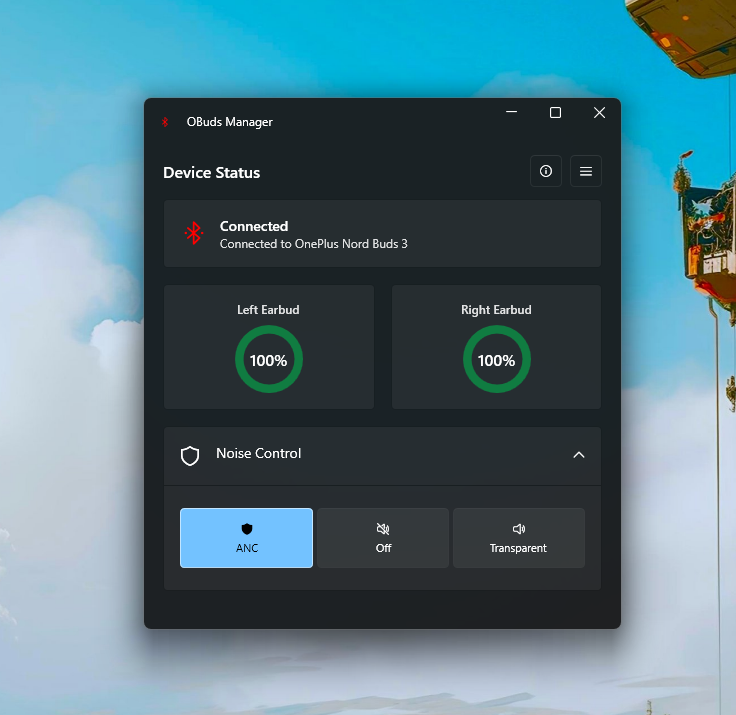

# OBuds Manager

A Fluent, modern Windows utility to manage noise control modes (ANC) and monitor battery levels for Oppo, OnePlus, and Realme Bluetooth earbuds.



---

## Installation

Download the pre-compiled setup installer (`OBudsManagerSetup.exe`) from the [GitHub Releases](https://github.com/siddhesh17b/OBudsManager/releases) page and run the installer. 

*Note: The installer requires administrative privileges to install the application into `C:\Program Files\OBuds Manager`.*

---

## Supported Devices

Any earbuds utilizing the **OPOv1** (Oppo Protocol) protocol:
- **OnePlus:** Nord Buds 3 Pro, Nord Buds 3, Nord Buds 2, Buds Pro 2, Buds Pro, etc.
- **Oppo:** Enco X2, Enco Free2, Enco Air3 Pro, Enco Air2 Pro, etc.
- **Realme:** Buds Air 5 Pro, Buds Air 3, etc.

*Note: Ensure your earbuds are paired and connected to Windows via Bluetooth before launching the application.*

---

## Protocol Reverse Engineering & Contributions

Special thanks to **[Aasheesh](https://github.com/AasheeshLikePanner)** for reverse engineering the OPOv1 protocol. If you want to contribute to expanding device support or add more features, here is the reference breakdown of how the protocol was cracked:

### 1. The btsnoop Capture
Android lets you enable **Bluetooth HCI snoop logging** in developer options. Every BLE packet between your phone and the earbuds gets captured. I copied that log to my laptop and opened it in Wireshark.

### 2. Decompiling HeyMelody
The official HeyMelody app has to communicate with the earbuds somehow. I pulled the APK, ran it through **jadx** (Java decompiler), and found the exact Java code that builds ANC commands:
```java
// Category = 0x04 (ANC), Sub-command = 0x04 (Set)
// Combined = 1028 = 0x0404
```

### 3. Finding the Right Service
The earbuds expose multiple BLE GATT services. Most people (including me initially) assumed the `FE2C` service was the main one.

**Wrong.** `FE2C` is for telemetry and firmware updates. The actual ANC commands go through **`0000079A`** — the OPO (Oppo/OnePlus) protocol service.

### 4. The Write Type Trap
In CoreBluetooth/WinRT Bluetooth APIs, there are two write types:
- `.withResponse` / `WriteWithResponse` — waits for acknowledgment
- `.withoutResponse` / `WriteWithoutResponse` — fire and forget

The earbuds **only** accept `.withoutResponse`. Using `.withResponse` silently fails without raising any errors.

### 5. Authentication Required
You cannot just send an ANC command. First you must:
1. Send **HELLO** packet.
2. Wait 2 seconds.
3. Send **REGISTER** with device token `B5 50 A0 69`.
4. Wait 1.5 seconds.
5. Then you can send commands.

### 6. The Response Channel Problem
The earbuds send responses on both `0000079A` and `FE2C` services. If you only subscribe to one, you miss the responses. The fix is to subscribe to notifications on every characteristic across both services.

---

## Building and Running

### Prerequisites
- **Operating System:** Windows 10 (build 19041+) or Windows 11
- **Developer SDK:** [.NET 10.0 SDK](https://dotnet.microsoft.com/download)

### Run Locally
To compile and run the application from source:
```powershell
dotnet run --project OBudsManager.csproj
```

### Publish Single-File Executable
To publish a portable, framework-dependent single-file Release binary:
```powershell
dotnet publish OBudsManager.csproj -c Release -r win-x64 --self-contained false -p:PublishSingleFile=true
```
The output executable will be placed in:
`bin\Release\net10.0-windows10.0.19041.0\win-x64\publish\OBudsManager.exe`

---

## Compiling the Setup Installer

### Prerequisites
- [Inno Setup 6](https://jrsoftware.org/ishelp/) installed on your machine.

### Compile Command
Run the Inno Setup compiler from PowerShell to compile the `OBudsManagerSetup.exe` installer package:
```powershell
& "C:\Program Files (x86)\Inno Setup 6\ISCC.exe" installer.iss
```
The compiled installer will be saved in the `Output/` folder:
`Output\OBudsManagerSetup.exe`

---

## Troubleshooting

- **No device detected?**
  Verify the earbuds are active and connected under Windows Bluetooth Settings.
- **Cannot delete installation files?**
  If the application is running, the uninstaller will automatically attempt to terminate it. If it fails, close the app from the system tray context menu and retry uninstallation.
